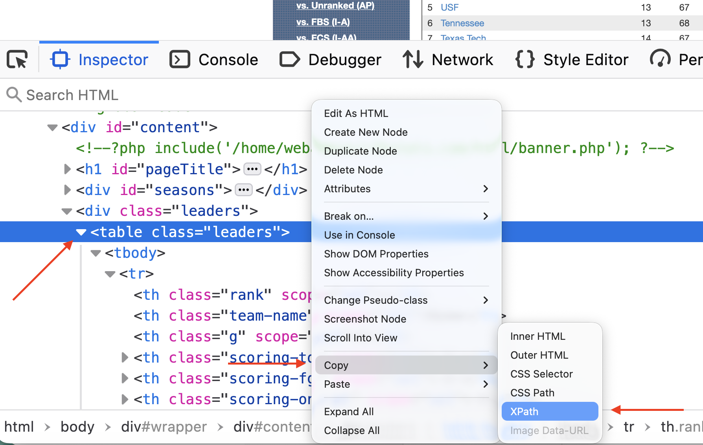

First, we need libraries

```{r}
library(tidyverse)
library(rvest)
```

Sometimes the Gods smile upon you and give you a page with simple HTML, nicely formatted with one header row. cfbstats.com is an example of that. [Here](https://cfbstats.com/2025/leader/national/team/offense/split01/category09/sort01.html) is there page for scoring offense stats. Open it in a browser because we're going to need it. 

### Scraping it

First, define a URL variable and fill it with our cfbstats url. 

```{r}
url <- "https://cfbstats.com/2025/leader/national/team/offense/split01/category09/sort01.html"
```

Next, Rvest works in four steps when it's a table.

1.  Start with your URL
2.  Run the whole request/response cycle with `read_html()`
3.  Find your table html with `html_node` and the xpath to it.
4.  Convert that to a dataframe

Let's start with the first two:

```{r}
url |> 
  read_html()
```
Okay, we can see that we are getting HTML from our URL. 

Because at NICAR, the network isn't guaranteed, let's save our HTML as `results` and use that instead of a fresh request every time. 

```{r}
results <- url |> 
  read_html()
```

Going forward, we will now use results instead of url |> read_html() because they are the same thing without having to stress the network. 

Now we need to get some information from the page. Specifically, we need the xpath to our HTML table.

In Chrome, Firefox or Edge, right-click on the upper right corner of your html table and go down to Inspect. It will look like this:

{width="45%"}

{width="45%"}

Note: If you are on Safari, you will have to enable developer tools to make this work.

Now, in the HTML window that pops up, locate the HTML `<table>` tag. It *must* be the `<table>` tag, not `<div class="table">`. One is a table, one is a division named table. The table will work, the division ... could ... work but will require a lot more code. This is the easy way, remember.

Click on the table tag so that it is highlighted. Then Right Click on that table tag, go down to Copy and then to Xpath.



Now that you have the Xpath copied, you're ready for the next step -- traversing the DOM (or Document Object Model) to isolate our table. 

```{r}
results |> 
  html_node(xpath = '/html/body/div/div[3]/div[2]/table')
```
Note: Different HTML engines in browsers come up with different answers for the Xcode. Yours might look slightly different than mine and still work. Firefox and Chrome do this a lot. 

Also note: Apostrophes around the Xpath, not quotes. Why? Because quotes can be a part of Xpaths. 

Now finally: Turn this all into a table. 

```{r}
results |> 
  html_node(xpath = '/html/body/div/div[3]/div[2]/table') |> 
  html_table()
```

Victory, right? Sort of. Note that the first column has no name. That will cause no end of problems for you down the road. Now is the time to fix that. 

When I teach scraping with rvest, the order of operations I give my students that works from a logical standpoint goes like this: 

1. Get the page. 
2. Get the data.
3. Clean the headers/column names. 
4. Clean the data. Got columns with $ or % in them? Strip them. Funny name splits? Fix them here. 
5. Save the data to a new dataframe. 
6. Analyze, visualize, profit. 

We've done 1 and 2. If we now do 3, 4 is done for us because cfbstats gets it and 5 and 6 will be up to you. 

How do we fix this? Because it's just one column, let's use the rename function from tidyr. 

```{r}
results |> 
  html_node(xpath = '/html/body/div/div[3]/div[2]/table') |> 
  html_table() |> 
  rename(
    Rank = 1
  )
```

I always think this is backwards from how my brain works, but rename says "name a column Rank and that's column 1 you're renaming." My brain wants it the other way, but that won't work. 

It won't always be this easy. Now try the Medium notebook. 